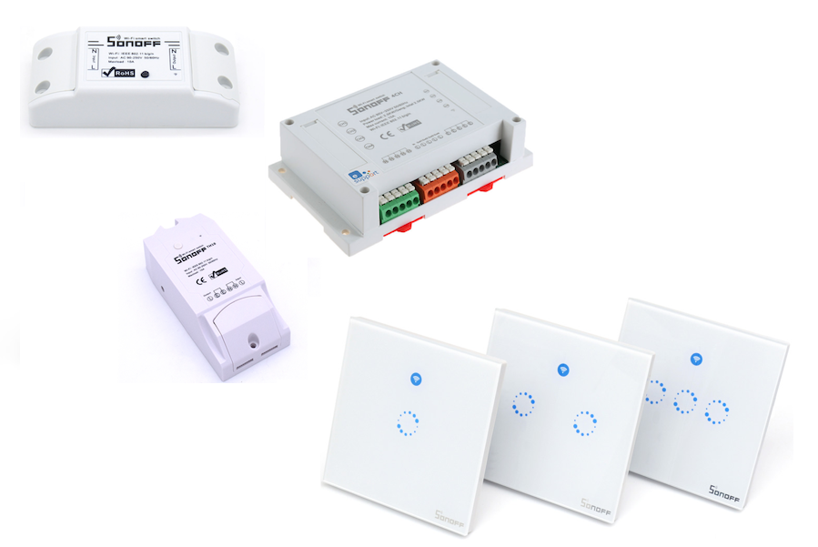

# KmanSonoff - Alternative firmware for Sonoff Switches



KmanSonoff is the updated version of [KmanOz/Sonoff-HomeAssistant](https://github.com/KmanOz/Sonoff-HomeAssistant) which is alternative firmware for the brilliant & cheap range of ESP-8266 based WiFi controlled power switches. This updated firmware simplifies setup of the switch even more so than the original, yet keeps the firmware and memory footprint basic and lightweight just like it's predecessor. Initial setup is now done in one file "config_sc.h" for the single channel firmware or "config_mc.h" for the multichannel firmware located in the same directory as the sketch. Both versions are OTA upgradable and all naming (mqtt client name & mDNS for OTA) is automatic based on the MAC address of the ESP Wifi radio.

I realize there are many other mqtt based firmware(s) that have been written for the Sonoff switches, but I found most of them overly complex for my liking. This firmware is basic in operation but ***extremely stable*** and just gets the job done.

#### Currently Supported Devices (More to come)

- [Sonoff Basic](https://www.itead.cc/smart-home/sonoff-wifi-wireless-switch.html?acc=70efdf2ec9b086079795c442636b55fb)
- [Sonoff TH10/TH16](https://www.itead.cc/sonoff-th.html?acc=70efdf2ec9b086079795c442636b55fb)
- [Sonoff Touch](https://www.itead.cc/smart-home/sonoff-touch.html?acc=70efdf2ec9b086079795c442636b55fb)
- [Sonoff S20](https://www.itead.cc/smart-home/smart-socket.html?acc=70efdf2ec9b086079795c442636b55fb)
- [Sonoff SV](https://www.itead.cc/smart-home/sonoff-sv.html?acc=70efdf2ec9b086079795c442636b55fb)
- [Sonoff 4CH](https://www.itead.cc/smart-home/sonoff-4ch.html?acc=70efdf2ec9b086079795c442636b55fb)
- [Sonoff 4CH PRO](https://www.itead.cc/sonoff-4ch-pro.html?acc=70efdf2ec9b086079795c442636b55fb)
- [Sonoff T1 (Up to 3 Ch)](https://www.itead.cc/sonoff-t1.html?acc=70efdf2ec9b086079795c442636b55fb)

You'll need the Arduino IDE and has been tested on 1.8.5 but should be backwards & forwards compatible with other versions.

## Configuration

**1. Clone the Repository**

Clone the **KmanSonoff** repository to your local machine. Copy the required version for your switch to your Arduino directory.

``` bash
$ git clone https://github.com/KmanOz/KmanSonoff
```
**2. Clone the LMROY version of the mqtt library**

I use the [lmroy](https://github.com/Imroy/pubsubclient) version of this excellent mqtt library, mainly because it supports QOS1 and keepalive settings right from within the sketch. No other modifications to library files are necessary.

It's currently setup to use only v3.1.1 of the mqtt standard and will only work on that version broker unless you modify the code so make sure your broker is setup to use v3.1.1 of the mqtt standard and not v3.1.

**FOR ALL THE PEOPLE THAT SKIP THIS STEP, DON'T. YOU CANNOT USE OTHER MQTT LIBRARIES**

``` bash
$ git clone https://github.com/Imroy/pubsubclient
```
**3. Install DHT library (If Temperature reporting is enabled)**

Uning the Arduino IDE's Library Manager install the DHT library if you plan on enabling Temperature reporting.


**3. Modify the details in the Arduino code (config.h) to your specific details and environment. (THIS IS IMPORTANT)**

To start off, change the "WIFI_SSID, WIFI_PASS, MQTT_SERVER, MQTT_PORT, MQTT_USER, MQTT_PASS in the Arduino code provided to suit your environment. 

``` bash
#define MQTT_SERVER     "192.168.0.100"                      // mqtt server
#define MQTT_PORT       1883                                 // mqtt port
#define MQTT_TOPIC      "home/sonoff/living_room/1"          // mqtt topic (Must be unique for each Sonoff)
#define MQTT_USER       "user"                               // mqtt user
#define MQTT_PASS       "pass"                               // mqtt password
#define WIFI_SSID       "homewifi"                           // wifi ssid
#define WIFI_PASS       "homepass"                           // wifi password
```

Additionally other parameters can be changed in the file at your discretion like whether or not you wish to remember the last relay state, retain mqtt messages, update frequecy for WiFi retries etc. See "config_sc.h or config_mc.h" for all options.

## Flashing the Firmware

I will assume you have the necessary skills to complete this step. As mentioned earlier, you'll need the Arduino IDE and you'll need to move the files you just cloned to the right directories. There are plenty or tutorials that cover all the steps involved already published on the Internet and it's only a Google search away.

As for the switch modifications, it's simply a matter of opening up the switch, installing a 4 or 5 pin header (depending on switch type) and then holding down the main switch (or installing a jumper on some models) on the unit before you power it up with your FTDI adapter. You are then good to go to re-flash your new firmware. The photo below is for illustration only and different products will require the same basic connection but headers will be located in different positions etc. (If anyone is willing to help, feel free to do a PR and add detailed instructions for other switches. Sorry too busy).


## HomeAssistant Integration

**1. Modify configuration.yaml in HomeAssistant and add the following to it.**

```bash
switch:
  - platform: mqtt
    name: "Living Room"
    state_topic: "home/sonoff/living_room/1/stat"
    command_topic: "home/sonoff/living_room/1"
    qos: 0
    payload_on: "on"
    payload_off: "off"
    retain: true
```
Assuming you make no changes to the topic in the code provided, you should be able to test the switch and be happy that you now have control using Home Assistant.

If you've the enabled temperature function, you can also setup sensors in HomeAssistant to display both Temperature & Humidity. Modify your configuration.yaml and add the following.

```bash
sensor:
  - platform: mqtt
    name: "Living Room Temp"
    state_topic: "home/sonoff/living_room/1/temp"
    qos: 1
    unit_of_measurement: "°C"
    value_template: "{{ value_json.Temp }}"
  
  - platform: mqtt
    name: "Living Room Humidity"
    state_topic: "home/sonoff/living_room/1/temp"
    qos: 1
    unit_of_measurement: "%"
    value_template: "{{ value_json.Humidity }}"
```

## Commands and Operation

**1. Commands**

As mentioned earlier, the commands are very basic. In fact the switch will respond to 4 basic mqtt commands and they are :-

- **on** (Turns the relay and LED on)(For 4CH precede the *on* command by the number of the relay. e.g 1on, 3on etc)
- **off** (Turns the relay and LED off)(For 4CH precede the *off* command by the number of the relay. e.g 2off, 3off etc)
- **stat** (Returns the status of the switch via mqtt message)(For 4CH the number of the relay will precede the status. e.g. 1on, 4off)
- **reset** (Forces a restart of the switch) (4 long flashes of the status LED)

If you've enabled the temperature function, you have an additional option.

- **temp** (Forces a temperature & humidity check otherwise it's reported every 1 minute) (1 short flash of the status LED)

**2. Operation**

When power is first applied the unit will immediately connect to your WiFi access point / router and your mqtt broker. When it connects the status LED will flash fast 4 times. That's it, your connected.

If you've enabled the temperature function, you will see a short single flash to indicate that the temperature & humidity has been published as well.

Press the switch on top to turn on the relay. Press it again to turn it off and watch the status change in HomeAssistant. Toggle the switch in HomeAssistant and the relay & LED will toggle accordingly. If your switch allows for an external wallswitch to be connected and that feature is enable, you should now be able to toggle the status of the Sonoff with the external wallswitch as well. 

To reset the switch manually, press and hold the switch for more than 4 seconds. (4CH press and hold Relay 1 switch) The switch will respond with 4 long flashes and reboot.

## OTA Updates

Assuming you have the correct environment setup for OTA (Python 2.7 installed) you can update the firmware via the Arduino IDE using OTA. The switch will publish it's name in the following format. (Sonoff_XXXXXX) X's will be replaced with the last 6 characters of the WiFi MAC address.

When the unit enters OTA, the status LED will flash twice. Once entered and firmware is being updated the status LED will flash fast continuously as packets are received. If the upload was successful the status LED will remain ON and in a short amount of time will turn off. The switch will reset and the status LED will flash 4 times fast and reconnect.

If unsuccessful after it enters OTA upgrade mode, it will exit with 2 fast flashes of the Status LED and either resume normally, or reset depending on the error.

## Versions

**KmanSonoff_v1.00sc** - Single Channel firmware used for original iTead Sonoff Switch, Sonoff Touch, Sonof S20 Smart Socket, Sonoff SV etc

**KmanSonoff_v1.00mc** - Multichannel firmware (Up to 4 Channels) used for Sonoff 4CH, 4CH Pro, Sonoff T1 (1, 2 & 3 CH), etc

## MIT License

Copyright (c) 2017

Permission is hereby granted, free of charge, to any person obtaining a copy
of this software and associated documentation files (the "Software"), to deal
in the Software without restriction, including without limitation the rights
to use, copy, modify, merge, publish, distribute, sublicense, and/or sell
copies of the Software, and to permit persons to whom the Software is
furnished to do so, subject to the following conditions:

The above copyright notice and this permission notice shall be included in all
copies or substantial portions of the Software.

THE SOFTWARE IS PROVIDED "AS IS", WITHOUT WARRANTY OF ANY KIND, EXPRESS OR
IMPLIED, INCLUDING BUT NOT LIMITED TO THE WARRANTIES OF MERCHANTABILITY,
FITNESS FOR A PARTICULAR PURPOSE AND NONINFRINGEMENT. IN NO EVENT SHALL THE
AUTHORS OR COPYRIGHT HOLDERS BE LIABLE FOR ANY CLAIM, DAMAGES OR OTHER
LIABILITY, WHETHER IN AN ACTION OF CONTRACT, TORT OR OTHERWISE, ARISING FROM,
OUT OF OR IN CONNECTION WITH THE SOFTWARE OR THE USE OR OTHER DEALINGS IN THE
SOFTWARE.

## Conclusion

That's about it. Any feature suggestions are welcome and I would be happy to answer any further questions that you may have. Additionally of you would like to contribute to this library please feel free to do a PR.


Enjoy!
